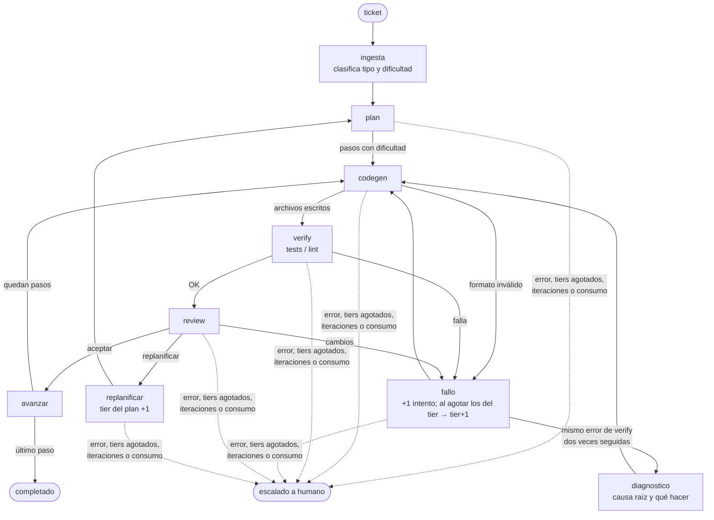

# graphai — grafo agéntico de desarrollo

CLI que resuelve tickets de desarrollo con un grafo de LangGraph: planifica, genera código,
lo verifica con los tests del repo, lo revisa y escala de modelo solo cuando hace falta.
Prioriza el costo: el código lo genera un **Qwen local** y la planificación/revisión usa
**OpenCode Go** (suscripción de tarifa plana). Un router propio elige el modelo en cada llamada.

El trabajo se hace en una **rama y un worktree aparte** (`agente/<id>`): tu copia de trabajo
no se toca y al final revisas un commit normal.

## Requisitos

- [uv](https://docs.astral.sh/uv/) y git.
- [Ollama](https://ollama.com) con `qwen3-coder:30b` (o cualquier servidor OpenAI-compatible
  local, p. ej. llama-server en `:8080`). Fija `OLLAMA_CONTEXT_LENGTH=32768` y reinicia Ollama:
  su API `/v1` ignora `num_ctx`. Si el servidor no responde, `grafo run` lo avisa y lanza
  `ollama serve` (desactívalo con `iniciar: false` en el backend `local`); `grafo status`
  muestra si está activo y si falta descargar el modelo.
- Opcional: suscripción a [OpenCode Go](https://opencode.ai/go). Sin clave, todo corre en local.

## Instalación

Instala un release (los tags están en [Releases](https://github.com/MoiMorua/graphai/releases)):

```powershell
uv tool install git+https://github.com/MoiMorua/graphai.git@v0.1.0

grafo login       # pide la clave de OpenCode Go sin eco y la guarda en ~/.config/grafo/.env
grafo status      # comprueba clave y configuración
grafo --version   # versión y origen de la instalación
```

Para desarrollar el propio grafo, instálalo en modo editable desde un clon (los cambios al
código aplican sin reinstalar): `uv tool install -e C:\ruta\graphai`.

### Actualizar

```powershell
grafo upgrade --check   # ¿hay un release más nuevo?
grafo upgrade           # instala el último release
grafo upgrade v0.1.0    # instala uno concreto (también sirve para volver atrás)
```

En Windows la instalación se hace en segundo plano en cuanto termina el comando (uv no puede
reemplazar `grafo.exe` mientras se ejecuta); el resultado queda en
`~/.config/grafo/logs/upgrade.log`. Con una instalación editable, `upgrade` no toca nada y te
indica cómo actualizar el clon; `grafo upgrade --forzar` la reemplaza por la del release.

## Uso

```powershell
cd C:\ruta\mi-repo
grafo run "Agrega validación de email en registro.py con sus tests"
```

Al terminar imprime el resultado y los comandos para continuar:

```
== T-1a2b3c4d: completado (todos los pasos aceptados)
   pasos 2/2 · iteraciones 2 · consumo Go $0.0415
   rama agente/T-1a2b3c4d · commit 72f3128
   revisar:  git diff HEAD...agente/T-1a2b3c4d
   integrar: git merge agente/T-1a2b3c4d
   limpiar:  git worktree remove "…"; git branch -D agente/T-1a2b3c4d
```

| Comando | Qué hace |
|---|---|
| `grafo run TICKET` | Ejecuta un ticket. Opciones: `--repo` (por defecto `.`), `--id`, `--verify CMD` (repetible), `--config`, `--en-sitio` |
| `grafo login [--key K]` | Guarda la clave de Go |
| `grafo logout` | Borra la clave guardada |
| `grafo status` | Muestra el home, la clave (enmascarada) y las capas de config que aplican aquí |
| `grafo upgrade [VERSION]` | Actualiza al último release o a `VERSION` (`--check`, `--forzar`) |
| `grafo mermaid` | Imprime el diagrama del grafo |
| `grafo --version` | Versión instalada y su origen |

- El worktree parte de `HEAD`: los cambios sin commitear no los ve. Solo se commitean los
  archivos que escribió el agente, también si el ticket termina escalado a humano.
- `--en-sitio` escribe directamente en el directorio, sin rama ni commit (útil sin git).
- Una variable de entorno `OPENCODE_GO_API_KEY` tiene prioridad sobre la clave guardada.

### Skill para agentes

`skills/grafo/SKILL.md` (en inglés, formato Agent Skills) enseña a un agente a usar el CLI:
comprobar requisitos, redactar el ticket, ejecutarlo, revisar la rama y diagnosticar escalados.

Instalar la skill es copiar la carpeta `skills/grafo/` (con su `SKILL.md`) al directorio de
skills de tu harness:

| Harness | Para todos tus proyectos | Solo para un repo |
|---|---|---|
| Claude Code | `~/.claude/skills/grafo/` | `<repo>/.claude/skills/grafo/` |
| Cursor | — | `<repo>/.cursor/skills/grafo/` |
| Otro | El directorio de skills que indique su documentación | |

Desde un clon de este repo, en PowerShell:

```powershell
# Claude Code, global
New-Item -ItemType Directory -Force $HOME\.claude\skills | Out-Null
Copy-Item -Recurse -Force .\skills\grafo $HOME\.claude\skills\

# Cursor (o Claude Code por proyecto), dentro del repo donde vas a usar grafo
New-Item -ItemType Directory -Force C:\ruta\mi-repo\.cursor\skills | Out-Null
Copy-Item -Recurse -Force .\skills\grafo C:\ruta\mi-repo\.cursor\skills\
```

En bash (macOS / Linux / Git Bash):

```bash
mkdir -p ~/.claude/skills && cp -r skills/grafo ~/.claude/skills/
mkdir -p /ruta/mi-repo/.cursor/skills && cp -r skills/grafo /ruta/mi-repo/.cursor/skills/
```

Sin clonar (el repo es público):

```bash
mkdir -p ~/.claude/skills/grafo
curl -fsSL https://raw.githubusercontent.com/MoiMorua/graphai/main/skills/grafo/SKILL.md -o ~/.claude/skills/grafo/SKILL.md
```

Para que la skill se actualice con el repo, usa un enlace en lugar de una copia. Si ya
copiaste la carpeta, bórrala antes: el enlace no se puede crear sobre una carpeta existente.

```powershell
# Windows (PowerShell). No uses `ln -s` de Git Bash: en Windows hace una copia, no un enlace.
New-Item -ItemType Junction -Path $HOME\.claude\skills\grafo -Target C:\ruta\graphai\skills\grafo
```

```bash
# macOS / Linux
ln -s /ruta/graphai/skills/grafo ~/.claude/skills/grafo
```

Reinicia la sesión del harness para que la detecte. Para comprobarlo, pide algo como
*"delegate this ticket to grafo"*: el agente debería empezar por `grafo status`.
Las rutas de Cursor y otros harnesses pueden cambiar entre versiones; si no la detecta,
revisa en su documentación dónde busca las skills.

## Cómo funciona



**Router.** Cada llamada pide un *rol* (`clasificar`, `plan`, `codegen`, `review`, `diagnostico`) y un *tier*.
El router toma el primer modelo del tier que tenga ese rol, tenga clave y no haya superado su
tope de Go; si ninguno sirve, prueba tiers superiores y luego inferiores. Si un modelo falla
(tope, error 4xx, respuesta vacía tras reintentos, contexto insuficiente) pasa al siguiente.

| Tier | Modelos (en orden de preferencia) | Intentos antes de escalar |
|---|---|---|
| 1 | `glm-flash` (Go) para plan/review/diagnostico · `qwen-local` para clasificar/codegen | 3 |
| 2 | `kimi-k3`, `deepseek-pro` (Go) | 3 |

**Escalado.** El tier es por paso: arranca en la dificultad que asignó el plan, y cada fallo de
verify o petición de cambios del revisor cuenta un intento; al agotarlos sube un tier. Un paso
que pasa del último tier, más de 2 replanificaciones, 25 iteraciones o $3 de consumo de Go por
ticket terminan en *escalado a humano*. Un paso de dificultad 2 genera código con Go, no en local.

**Ayudas al modelo.** Codegen recibe el árbol del repo, no solo los archivos del paso, y puede
crear archivos de soporte (configuración, `conftest.py`, `__init__.py`…). Si la salida de verify
coincide con un error de entorno conocido (import de Python, JS/TS, Rust o Go; comando
inexistente; timeout), el feedback lleva antes una línea `PISTA:` con la causa probable. Si el
modelo repite los mismos archivos con el mismo error, se le avisa una vez (`AVISO:`) y, si
vuelve a repetirlos, el paso sube de tier sin agotar sus intentos.

**Diagnóstico.** Si verify falla dos veces seguidas con el mismo error (aunque el código haya
cambiado), un modelo del rol `diagnostico` recibe el error, el árbol del repo y los archivos, y
responde la causa raíz y qué cambiar; eso va al principio del feedback del siguiente intento
(`DIAGNÓSTICO:`). Se hace una vez por error distinto, y si no hay modelo disponible el ticket
sigue sin él. La salida de cada comando de verify se recorta a 4000 caracteres conservando el
principio (donde suele estar el primer error) y el final (el resumen).

**Topes de Go.** Go descuenta el uso del tope mensual de cada modelo a precio de lista, con
ventanas de 5 h (20 %), 7 días (50 %) y 30 días (100 %). Cada llamada queda en
`~/.config/grafo/logs/uso.jsonl` y el router no elige un modelo que ya superó alguna ventana.

## Configuración

Se fusionan tres capas (dicts clave a clave; las listas se reemplazan completas):

| Capa | Para qué |
|---|---|
| `grafo/models.yaml` | Valores por defecto (dentro del paquete): backends, modelos, tiers, límites, verify |
| `~/.config/grafo/models.yaml` o `--config` | Tus ajustes globales |
| `<repo>/.grafo.yaml` | Ajustes del repo; lo típico son los comandos de verificación |

```yaml
# .grafo.yaml
verify:
  comandos: [uv run pytest -q, uv run ruff check .]
limites:
  max_iteraciones_ticket: 10
```

El verify por defecto es `uv run --with pytest pytest -q` (acepta el código 5 de pytest, "sin tests").

| Ruta | Contenido |
|---|---|
| `~/.config/grafo/.env` | Clave de Go (`grafo login`) |
| `~/.config/grafo/logs/uso.jsonl` | Una línea por llamada: modelo, tokens, consumo, segundos |
| `~/.config/grafo/worktrees/<repo>/<id>` | Worktrees de los tickets |
| `<repo>/.grafo/tickets/<id>.json` | Estado final de cada ticket (añade `.grafo/` al `.gitignore`) |

La variable `GRAFO_HOME` cambia la ubicación de `~/.config/grafo`.

## Desarrollo

```powershell
uv sync           # entorno con dependencias de desarrollo
uv run pytest -q
uv run grafo --help
```

| Archivo | Qué hace |
|---|---|
| `grafo/__main__.py` | CLI y subcomandos |
| `grafo/grafo.py` | Nodos y aristas condicionales |
| `grafo/nodos.py` | Implementación de los nodos y prompts |
| `grafo/router.py` | Clasificador y selección de modelo por rol/tier |
| `grafo/local.py` | Detección del modelo local y arranque de `ollama serve` |
| `grafo/llm.py` | Cliente OpenAI-compatible: reintentos con backoff, guard de contexto, registro de consumo |
| `grafo/presupuesto.py` | Registro de uso y comprobación de las ventanas de Go |
| `grafo/config.py` | Carga de configuración por capas |
| `grafo/git.py` | Rama + worktree por ticket y commit |
| `grafo/credenciales.py` | Guardar, leer y borrar la clave de Go |
| `grafo/actualizar.py` | Versión instalada, consulta de releases y `upgrade` |

El CLI con subcomandos lo implementó el propio agente (`grafo run` sobre este repo).

### Publicar un release

La versión vive en `pyproject.toml` y el tag debe coincidir (`v` + versión). Con el bump
integrado en `main` (por PR o directamente):

```powershell
uv version --bump minor          # 0.1.0 -> 0.2.0 (o patch / major); actualiza pyproject.toml y uv.lock
git commit -am "Release v0.2.0"  # y abre el PR, o súbelo a main
# ya en main, con el commit integrado:
git tag v0.2.0
git push origin v0.2.0
```

El tag dispara `.github/workflows/release.yml`: comprueba que coincide con `pyproject.toml`,
corre los tests, construye wheel y sdist y crea el GitHub Release con notas generadas a partir
de los PRs. `.github/workflows/ci.yml` corre los tests en cada PR y en cada push a `main`.

## Pendientes

- Precios de los modelos de Go y slug de `deepseek-v4-pro` sin confirmar (`glm-5.3-flash` y
  `kimi-k3` ya respondieron); el consumo registrado es una estimación.
- Codegen reescribe archivos completos; para archivos grandes convendrá pasar a ediciones parciales.
- Los pasos se ejecutan en secuencia; paralelizar codegen queda para después.
