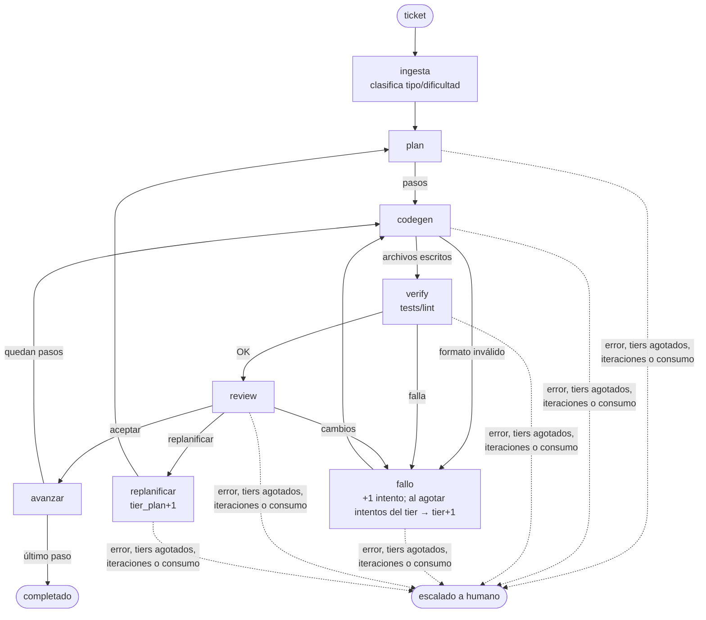

# Grafo agéntico de desarrollo

LangGraph + router propio. Codegen en Qwen local; plan/review en OpenCode Go (tarifa plana).
Contexto completo en `contexto-grafo-agentico.txt`.



## Uso

Instalación (una vez), como comando global `grafo`:

```powershell
uv tool install -e C:\Users\moi\projects\agent   # -e: los cambios al código aplican sin reinstalar
copy .env.example $HOME\.config\grafo\.env       # pon ahí OPENCODE_GO_API_KEY
```

En cualquier repo:

```powershell
cd C:\ruta\otro-repo
grafo "descripción del ticket"             # rama agente/<id> en un worktree aparte + commit
grafo "descripción del ticket" --en-sitio  # escribe directo en el directorio (sin git)
```

Por defecto el agente **no toca tu copia de trabajo**: crea la rama `agente/<id>` desde `HEAD`
en `~/.config/grafo/worktrees/<repo>/<id>`, commitea solo los archivos que escribió y te
imprime cómo revisar (`git diff HEAD...agente/<id>`), integrar y limpiar. Requiere git;
los cambios sin commitear de tu copia de trabajo no los ve.

### Configuración por capas

| Capa | Para qué |
|---|---|
| `grafo/models.yaml` | Valores por defecto (en el paquete) |
| `~/.config/grafo/models.yaml` o `--config` | Tus ajustes globales: modelos, tiers, límites |
| `<repo>/.grafo.yaml` | Ajustes del repo; lo típico es `verify` |

Los dicts se fusionan clave a clave y las listas se reemplazan. Ejemplo de `.grafo.yaml`:

```yaml
verify:
  comandos: [uv run pytest -q, uv run ruff check .]
limites:
  max_iteraciones_ticket: 10
```

| Ruta | Contenido |
|---|---|
| `~/.config/grafo/.env` | `OPENCODE_GO_API_KEY` |
| `~/.config/grafo/logs/uso.jsonl` | Una línea por llamada; global porque los topes de Go son por cuenta |
| `<repo>/.grafo/tickets/<id>.json` | Estado final de cada ticket (añade `.grafo/` a tu `.gitignore`) |

`GRAFO_HOME` cambia la ubicación de `~/.config/grafo`.

Desarrollo del grafo: `uv sync`, `uv run grafo --mermaid`, `uv add <paquete>`.

## Piezas

| Archivo | Qué hace |
|---|---|
| `grafo/models.yaml` | Config por defecto: backends, modelos (roles, precio, tope Go), tiers, límites, verify |
| `grafo/config.py` | Carga por capas y rutas globales |
| `grafo/git.py` | Rama + worktree por ticket y commit de los archivos escritos |
| `grafo/router.py` | Clasificador + selección: tier pedido → primer modelo disponible (clave, rol, tope Go); si no hay, sube y luego baja |
| `grafo/llm.py` | Cliente OpenAI-compatible por backend: reintentos con backoff, guard de `num_ctx`, consumo de topes de Go |
| `grafo/presupuesto.py` | Registro de consumo y ventanas de Go (5h 20 %, 7d 50 %, 30d 100 %) |
| `grafo/nodos.py` | Nodos del grafo y prompts |
| `grafo/grafo.py` | Aristas y condiciones |

## Pendientes

- Instalar git (`winget install Git.Git`) y probar el modo rama/worktree: aún no se ha ejecutado.
- Verificar slugs y precios de Go en `models.yaml` (están marcados como provisionales).
- Fijar `OLLAMA_CONTEXT_LENGTH` (p. ej. 32768) y reiniciar Ollama: la API `/v1` ignora `num_ctx`.
- Codegen reescribe archivos completos; para archivos grandes convendrá pasar a diffs/edits.
- Pasos secuenciales; la paralelización de codegen queda para después.
