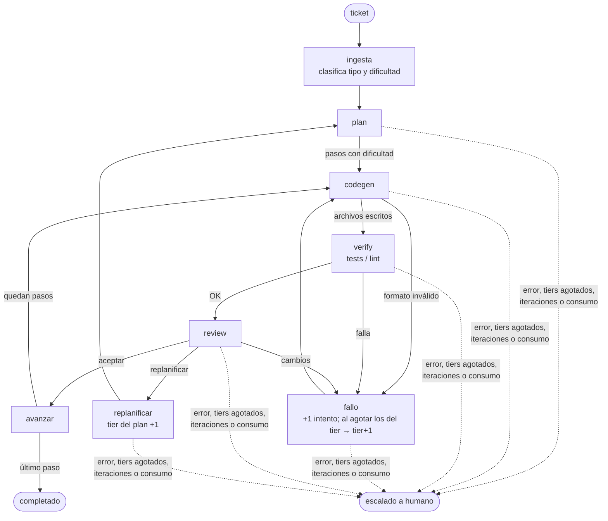

# graphai — grafo agéntico de desarrollo

CLI que resuelve tickets de desarrollo con un grafo de LangGraph: planifica, genera código,
lo verifica con los tests del repo, lo revisa y escala de modelo solo cuando hace falta.
Prioriza el costo: el código lo genera un **Qwen local** y la planificación/revisión usa
**OpenCode Go** (suscripción de tarifa plana). Un router propio elige el modelo en cada llamada.

El trabajo se hace en una **rama y un worktree aparte** (`agente/<id>`): tu copia de trabajo
no se toca y al final revisas un commit normal.

## Requisitos

- [uv](https://docs.astral.sh/uv/) y git.
- [Ollama](https://ollama.com) con `qwen3-coder:30b` (o cualquier servidor OpenAI-compatible
  local, p. ej. llama-server en `:8080`). Fija `OLLAMA_CONTEXT_LENGTH=32768` y reinicia Ollama:
  su API `/v1` ignora `num_ctx`.
- Opcional: suscripción a [OpenCode Go](https://opencode.ai/go). Sin clave, todo corre en local.

## Instalación

```powershell
uv tool install git+ssh://git@github.com/MoiMorua/graphai.git
# o, desde un clon y en modo editable (los cambios al código aplican sin reinstalar):
uv tool install -e C:\ruta\graphai

grafo login     # pide la clave de OpenCode Go sin eco y la guarda en ~/.config/grafo/.env
grafo status    # comprueba clave y configuración
```

## Uso

```powershell
cd C:\ruta\mi-repo
grafo run "Agrega validación de email en registro.py con sus tests"
```

Al terminar imprime el resultado y los comandos para continuar:

```
== T-1a2b3c4d: completado (todos los pasos aceptados)
   pasos 2/2 · iteraciones 2 · consumo Go $0.0415
   rama agente/T-1a2b3c4d · commit 72f3128
   revisar:  git diff HEAD...agente/T-1a2b3c4d
   integrar: git merge agente/T-1a2b3c4d
   limpiar:  git worktree remove "…"; git branch -D agente/T-1a2b3c4d
```

| Comando | Qué hace |
|---|---|
| `grafo run TICKET` | Ejecuta un ticket. Opciones: `--repo` (por defecto `.`), `--id`, `--verify CMD` (repetible), `--config`, `--en-sitio` |
| `grafo login [--key K]` | Guarda la clave de Go |
| `grafo logout` | Borra la clave guardada |
| `grafo status` | Muestra el home, la clave (enmascarada) y las capas de config que aplican aquí |
| `grafo mermaid` | Imprime el diagrama del grafo |

- El worktree parte de `HEAD`: los cambios sin commitear no los ve. Solo se commitean los
  archivos que escribió el agente, también si el ticket termina escalado a humano.
- `--en-sitio` escribe directamente en el directorio, sin rama ni commit (útil sin git).
- Una variable de entorno `OPENCODE_GO_API_KEY` tiene prioridad sobre la clave guardada.

## Cómo funciona



**Router.** Cada llamada pide un *rol* (`clasificar`, `plan`, `codegen`, `review`) y un *tier*.
El router toma el primer modelo del tier que tenga ese rol, tenga clave y no haya superado su
tope de Go; si ninguno sirve, prueba tiers superiores y luego inferiores. Si un modelo falla
(tope, error 4xx, respuesta vacía tras reintentos, contexto insuficiente) pasa al siguiente.

| Tier | Modelos (en orden de preferencia) | Intentos antes de escalar |
|---|---|---|
| 1 | `glm-flash` (Go) para plan/review · `qwen-local` para clasificar/codegen | 3 |
| 2 | `kimi-k3`, `deepseek-pro` (Go) | 3 |

**Escalado.** El tier es por paso: arranca en la dificultad que asignó el plan, y cada fallo de
verify o petición de cambios del revisor cuenta un intento; al agotarlos sube un tier. Un paso
que pasa del último tier, más de 2 replanificaciones, 25 iteraciones o $3 de consumo de Go por
ticket terminan en *escalado a humano*. Un paso de dificultad 2 genera código con Go, no en local.

**Topes de Go.** Go descuenta el uso del tope mensual de cada modelo a precio de lista, con
ventanas de 5 h (20 %), 7 días (50 %) y 30 días (100 %). Cada llamada queda en
`~/.config/grafo/logs/uso.jsonl` y el router no elige un modelo que ya superó alguna ventana.

## Configuración

Se fusionan tres capas (dicts clave a clave; las listas se reemplazan completas):

| Capa | Para qué |
|---|---|
| `grafo/models.yaml` | Valores por defecto (dentro del paquete): backends, modelos, tiers, límites, verify |
| `~/.config/grafo/models.yaml` o `--config` | Tus ajustes globales |
| `<repo>/.grafo.yaml` | Ajustes del repo; lo típico son los comandos de verificación |

```yaml
# .grafo.yaml
verify:
  comandos: [uv run pytest -q, uv run ruff check .]
limites:
  max_iteraciones_ticket: 10
```

El verify por defecto es `uv run --with pytest pytest -q` (acepta el código 5 de pytest, "sin tests").

| Ruta | Contenido |
|---|---|
| `~/.config/grafo/.env` | Clave de Go (`grafo login`) |
| `~/.config/grafo/logs/uso.jsonl` | Una línea por llamada: modelo, tokens, consumo, segundos |
| `~/.config/grafo/worktrees/<repo>/<id>` | Worktrees de los tickets |
| `<repo>/.grafo/tickets/<id>.json` | Estado final de cada ticket (añade `.grafo/` al `.gitignore`) |

La variable `GRAFO_HOME` cambia la ubicación de `~/.config/grafo`.

## Desarrollo

```powershell
uv sync           # entorno con dependencias de desarrollo
uv run pytest -q
uv run grafo --help
```

| Archivo | Qué hace |
|---|---|
| `grafo/__main__.py` | CLI y subcomandos |
| `grafo/grafo.py` | Nodos y aristas condicionales |
| `grafo/nodos.py` | Implementación de los nodos y prompts |
| `grafo/router.py` | Clasificador y selección de modelo por rol/tier |
| `grafo/llm.py` | Cliente OpenAI-compatible: reintentos con backoff, guard de contexto, registro de consumo |
| `grafo/presupuesto.py` | Registro de uso y comprobación de las ventanas de Go |
| `grafo/config.py` | Carga de configuración por capas |
| `grafo/git.py` | Rama + worktree por ticket y commit |
| `grafo/credenciales.py` | Guardar, leer y borrar la clave de Go |

El CLI con subcomandos lo implementó el propio agente (`grafo run` sobre este repo).

## Pendientes

- Precios de los modelos de Go y slug de `deepseek-v4-pro` sin confirmar (`glm-5.3-flash` y
  `kimi-k3` ya respondieron); el consumo registrado es una estimación.
- Codegen reescribe archivos completos; para archivos grandes convendrá pasar a ediciones parciales.
- Los pasos se ejecutan en secuencia; paralelizar codegen queda para después.
